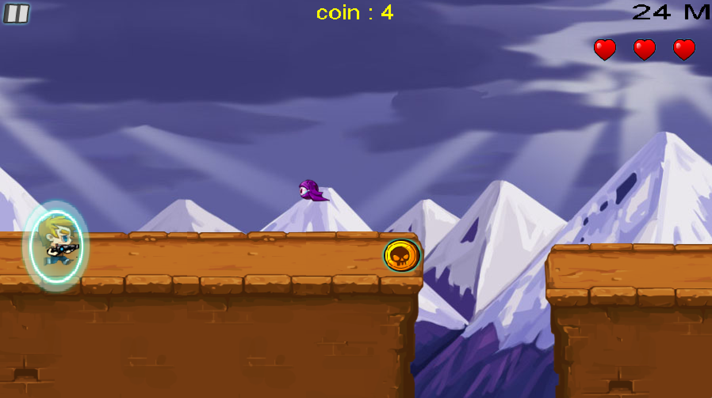

# ZombieDash
This is an implementation of the famous mobile game, Zombie Dash, in C++ using SDL 2.0 framework.

## Features
Randomly generated map  
Choosing characters  
Bonus boxes include gun or shields  
You loose a life when you hit a bat or a shield  
Collecting coins  
### Welcome Screen

### Choosing Characters

### Gameplay

### Game Over

